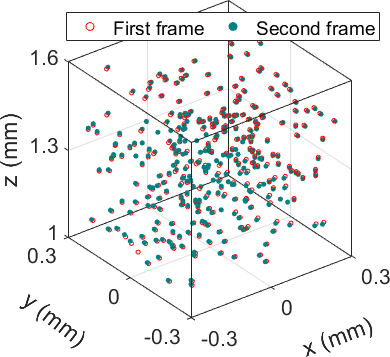
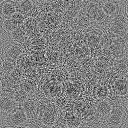
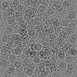
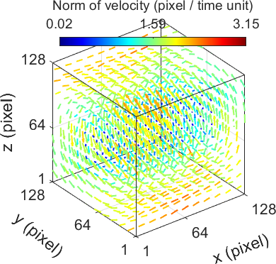

## Space-Time 4D Holographic PTV

[](https://www.gnu.org/licenses/old-licenses/gpl-2.0.en.html) 

[Project Page](https://ni-chen.github.io/HoloFlow-PTV/) | [Paper](https://onlinelibrary.wiley.com/journal/18638899)

[**Snapshot Space-Time Holographic 3D Particle Tracking Velocimetry**](https://ni-chen.github.io/HoloFlow-PTV/)  in _Laser & Photonics Reviews_, 2021. <br>
 [Ni Chen](https://ni-chen.github.io)\*,  [Congli Wang](https://congliwang.github.io)\*, and  [Wolfgang Heidrich](https://vccimaging.org/People/heidriw/) <br>
 King Abdullah University of Science and Technology <br>
 \*denotes equal contribution 


--------------------------------------------


### Overview

This repository contains **MATLAB** and **CUDA** (not yet published) implementation of the Holo-Flow framework.


----------------------------------

### Requirements

 - Matlab or CUDA.
 - Two Matalb Addons are also required for visualization:
    - Image ellipsoid 3D: https://www.mathworks.com/matlabcentral/fileexchange/34104-image-ellipsoid-3d?s_tid=srchtitle_drawEllipsoid_2
    - export_fig: https://www.mathworks.com/matlabcentral/fileexchange/23629-export_fig


## How to use

1. Clone the code 

```
git clone https://github.com/Ni-Chen/HoloFlow-PTV.git
```

2. Download the sample data from [Dropbox](https://www.dropbox.com/scl/fo/y6vndhv11014ntei576jr/h?dl=0&rlkey=xuoo3gbgggyr7n0o30x2hw3u2), and put it in folder of 'code/data/simulation'
   
3. Run the code

   - For MATLAB version, go into /HoloFlow-PTV/code/, run 'main.m'. 

   - For CUDA version, compile the code firstly. (Documentation is under construction.) 

   - Sample results:

     
|                       particle volumes                       |                  hologram #1                   |                  hologram #2                   |                     reconstructed flow                      |
| :----------------------------------------------------------: | :--------------------------------------------: | :--------------------------------------------: | :---------------------------------------------------------: |
|  |  |  |  |


3. Prepare your data if you need to test it.
    - The hologram frames are stored in ./data/ as a  .mat file 

    - The .mat file is of size $N_y \times N_x \times N_{frame}$, where $N_y \times N_x $ is the hologram dimensions and $N_{frame}$ is the frame number.

    - The holography system parameters are stored as a structure and named as *params*, where

```matlab
params.dz       % depth interval of the object
params.Nz       % depth number of the particle volume
params.Nx/Ny    % lateral dimension of the particle volume
params.pps      % pixel pitch of the hologram
params.lambda   % wavelength of the light source
```


  - For the Holo-Flow reconstruction, you need to set the below parameters:

```matlab
%% holo solver parameters
fasta.ratio = 1;      % alpha-beta ratio if the lateral and axial pixel pitch are different in the particle volume
fasta.mu = 0.1;       % FASTA deconvolution
fasta.maxIters = 20;  % FASTA iteration number, 10-20 is OK

%% flow parameters
flow.flow.warping_iters = [3 3 3];  % Depends on the range of the flow
flow.flow.ratio = ratio;   % alpha-beta ratio if the lateral and axial pixel pitch are different in the particle volume
flow.flow.priors = priors; %[1e-4 1e-4 1e-6 1e-6]
flow.cg.maxit = 1000;      % Flow solver iteration number
flow.cg.tol = 1e-3;        % flow error tollorance

% additional parameters
other.tau = 0.001;  % As the difination in the paper
other.maxit = 3;    % The outer iteration
```


-------------------------------------

## Contact

Ni Chen (nichen@arizona.edu), Congli Wang (congli.wang@kaust.edu.sa)
