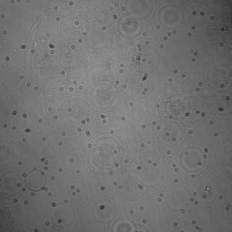
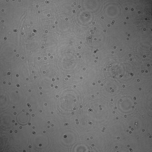
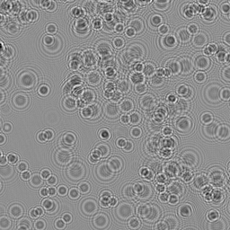

<h2 class="section-title"> Snapshot space-time holographic 3D particle tracking velocimetry  </h2>
<h5 class="pubname"> Laser & Photonics Reviews, 2021 </h5>
<nav class="text-center" style="width: 100%">
  <a href="https://ni-chen.github.io/" class="author">Ni Chen&dagger;</a>
  <a href="http://congliwang.github.io/" class="author">Congli Wang&dagger;</a>
  <a href="http://vccimaging.org/People/heidriw/" class="author"> Wolfgang Heidrich </a>
</nav>
<nav>
 KAUST 
</nav>

<section class="container">
<abstract>
<h5 class="section-title">  Abstract  </h5>
Digital inline holography is an amazingly simple and effective approach for three-dimensional imaging, to which particle tracking velocimetry is of particular interest. Conventional digital holographic particle tracking velocimetry techniques are computationally separated in particle and flow reconstruction, plus the expensive computations. Usually, the particle volumes are recovered firstly, from which fluid flows are computed. Without iterative reconstructions, This sequential space-time process lacks accuracy. This paper presents a joint optimization framework for digital holographic particle tracking velocimetry: particle volumes and fluid flows are reconstructed jointly in a higher space-time dimension, enabling faster convergence and better reconstruction quality of both fluid flow and particle volumes within a few minutes on modern GPUs. Synthetic and experimental results are presented to show the efficiency of the proposed technique.
  
</abstract>
</section>

<!-- Framework -->
<section class="container">
<h5 class="section-title"> Framework </h5>
<figure>

<figcaption>
Fig. 1: Overall pipeline of our DIH-PTV space-time particle-flow reconstruction algorithm. Given single-shot hologram images, we obtained simultaneously spatial particle volumes and temporal fluid flows by solving the challenging inverse problem via alternating optimization of custom solvers with domain-specific priors.
</figcaption>
</figure>
</section>

<!-- Results -->
<section class="container">
<h5 class="section-title"> Some results  </h5>
<figure>
  
  
  
   
  
  
  
  <figcaption>
  Fig. 2: Sample holograms and the corresponding reconstructions. 
  </figcaption>
</figure>
</section>

<!-- Data -->

<!-- Downloads -->
<section class="container">
<h5 class="section-title">  Downloads </h5>

The manuscript link  | Github project link 

</section> 

<section class="container">
<h5 class="section-title"> Bibtex </h5>
<pre>
  @article{Chen2021LPOR,
    title      = {Snapshot space-time holographic 3D particle tracking velocimetry},
    author     = {Ni Chen and Congli Wang and Wolfgang Heidrich},
    journal    = {Laser \& Photonics Reviews},
    year       = {2021},
    month      = {April},
    doi        = {10.1002/lpor.202100008},
    url        = {https://onlinelibrary.wiley.com/doi/full/10.1002/lpor.202100008},
    }
</pre>
</section>

